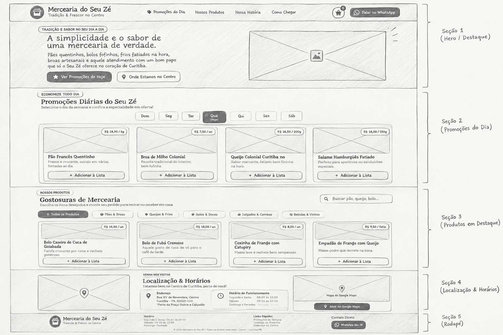

# 🏪 Mercearia do Seu Zé

Projeto acadêmico desenvolvido para a criação da presença digital da **Mercearia do Seu Zé**, tradicional estabelecimento localizado no Centro de Curitiba — PR.

O projeto busca unir a tradição de uma mercearia de bairro com recursos digitais que facilitem o acesso às informações da loja e aproximem o estabelecimento de novos clientes.

---

## 📋 Sobre o Projeto

A **Mercearia do Seu Zé** possui uma história de mais de quatro décadas no Centro de Curitiba, mantendo como principais características o atendimento próximo, a variedade de produtos e a relação de confiança com seus clientes.

O projeto foi desenvolvido com o objetivo de criar uma presença digital para a mercearia, tornando mais fácil para moradores, estudantes, jovens profissionais e novos moradores da região encontrarem informações sobre o estabelecimento.

A proposta é funcionar como um **cartão de visitas digital**, apresentando de maneira simples e acessível os produtos, promoções, horários de funcionamento, localização e formas de contato.

---

## 🎯 Objetivo

Desenvolver uma página web para aumentar a presença digital da Mercearia do Seu Zé e facilitar o acesso dos clientes às principais informações do estabelecimento.

A solução busca:

* Apresentar a história e a identidade da mercearia;
* Divulgar produtos e promoções;
* Informar os horários de funcionamento;
* Apresentar a localização da loja;
* Facilitar o contato através do WhatsApp;
* Permitir que o cliente monte uma lista de produtos e envie o pedido pelo WhatsApp;
* Criar uma experiência simples e acessível para usuários de diferentes faixas etárias.

---

## 👥 Público-Alvo

O público-alvo principal é formado por:

* Jovens adultos;
* Estudantes universitários;
* Jovens profissionais;
* Novos moradores do Centro de Curitiba e regiões próximas.

Como público secundário, a página também atende familiares de clientes antigos que procuram informações como endereço, horário de funcionamento e contato da mercearia.

---

## 💡 Solução Desenvolvida

A página foi estruturada para apresentar as informações mais importantes logo durante a navegação, mantendo uma identidade visual inspirada no conceito tradicional das mercearias de bairro.

Entre os principais recursos desenvolvidos estão:

### 🏠 Página inicial

Apresentação da Mercearia do Seu Zé, sua proposta e seus principais diferenciais.

### 🏷️ Promoções

Sistema de promoções organizadas por dia da semana, permitindo que o usuário selecione um dia e visualize a oferta correspondente.

### 🛒 Catálogo de produtos

Catálogo organizado por categorias, incluindo:

* Pães e Broas;
* Queijos e Frios;
* Bolos e Doces;
* Salgados e Combos;
* Bebidas e Vinhos.

### 🔎 Pesquisa e filtros

O usuário pode pesquisar produtos pelo nome ou descrição e filtrar os produtos por categoria.

### 🧺 Lista de pedidos

O usuário pode adicionar produtos a uma lista, alterar suas quantidades e visualizar o valor total estimado.

### 📱 Integração com WhatsApp

Após montar sua lista, o usuário pode enviar o pedido diretamente pelo WhatsApp da mercearia.

### 📍 Localização

A página apresenta o endereço da mercearia e uma integração com o Google Maps.

### 🕐 Horário de funcionamento

O site apresenta os horários de funcionamento e informa dinamicamente se a loja está aberta ou fechada.

---

## 🛠️ Tecnologias Utilizadas

* **HTML5** — estruturação e organização semântica da página;
* **CSS3** — ajustes e personalizações visuais;
* **JavaScript** — interatividade e funcionalidades da aplicação;
* **Tailwind CSS** — estilização e construção da interface;
* **Git** — controle de versão;
* **GitHub** — armazenamento e colaboração no projeto;
* **Google Fonts** — tipografia;
* **Font Awesome** — ícones;
* **Google Maps** — localização da mercearia;
* **WhatsApp** — canal de contato e envio de pedidos.

---

## 🎨 Arquitetura e Interface

A interface foi desenvolvida com uma proposta visual que busca transmitir a sensação de uma **mercearia tradicional**, utilizando elementos como cores quentes, tons terrosos, tipografia serifada e referências visuais relacionadas a produtos artesanais.

A estrutura da página foi organizada considerando:

1. Barra de informações;
2. Cabeçalho e navegação;
3. Apresentação principal;
4. Promoções;
5. Catálogo de produtos;
6. História da mercearia;
7. Localização e horários;
8. Rodapé;
9. Lista de pedidos.

O projeto também conta com adaptação para diferentes tamanhos de tela, buscando proporcionar uma experiência adequada em dispositivos móveis e computadores.

---

## 📐 Baixa Fidelidade

Antes da finalização da documentação visual do projeto, a equipe elaborou um protótipo de baixa fidelidade para representar a estrutura e organização da página.



O wireframe apresenta a disposição dos principais elementos da interface, como:

* Cabeçalho;
* Promoções;
* Produtos;
* Informações da mercearia;
* Localização;
* Contatos;
* Rodapé.

---

# 👨‍💻 Integrantes

## Patryck Geovany Tavares de Oliveira

**Formação:**
Análise e Desenvolvimento de Sistemas — Universidade Positivo (cursando).

**Competências técnicas:**

* HTML;
* CSS;
* PHP;
* Python;
* Word;
* Excel;
* Desenvolvimento e manutenção de páginas web.

**Experiência:**

Atuação como Atendente de Telemarketing e como Programador Jr., com experiência em atendimento ao público e desenvolvimento de websites personalizados.

**Perfil profissional:**

Possui facilidade de comunicação e interesse em desenvolvimento de soluções digitais, buscando transformar necessidades em soluções funcionais.

---

## Marcelo Saraiva

**Formação:**

* Análise e Desenvolvimento de Sistemas — graduação em andamento;
* Técnico em Administração — concluído;
* Ensino Médio — concluído em 2025.

**Cursos e qualificações:**

* Algoritmos e Lógica de Programação — Curso em Vídeo;
* HTML5 e CSS3 — Curso em Vídeo;
* Python — Curso em Vídeo;
* Git e GitHub — Curso em Vídeo.

**Competências técnicas:**

* HTML;
* CSS;
* Python;
* Git;
* GitHub;
* JavaScript;
* React;
* Figma;
* Prototipagem;
* Engenharia de Prompt.

**Projetos:**

Participação no projeto acadêmico **DuplaSegura**, voltado à segurança de estudantes durante o deslocamento após a faculdade, envolvendo criação de persona, prototipagem e definição de tecnologias.

Também possui experiência em projetos relacionados a administração, organização, vendas, apresentações e trabalho em equipe.

---

## Marcelo Bento da Luz

**Formação:**

* Análise e Desenvolvimento de Sistemas — Universidade Positivo, cursando;
* Ensino Médio — concluído em 2025.

**Experiência:**

Estágio Administrativo na GOU Odonto, com atuação em rotinas administrativas, organização de documentos, controle de planilhas e relatórios, suporte operacional, atendimento e apoio em redes sociais.

**Competências técnicas:**

* HTML;
* CSS;
* Python;
* Java (em aprendizado);
* GitHub;
* n8n;
* Automação de processos.

**Projetos:**

Desenvolvimento de um **Bot Contador de Calorias com Automação**, utilizando n8n, integração com IA e armazenamento de dados em planilhas.

Também desenvolveu um sistema de **Cadastro de Produtos em Python**, com funcionalidades de cadastro, consulta, alteração e remoção de produtos.

**Perfil profissional:**

Facilidade de aprendizado, boa comunicação, organização e proatividade, com interesse em desenvolvimento de software, automação de processos e soluções digitais.

---

## Eduardo Ducca de Melo

**Formação:**

Análise e Desenvolvimento de Sistemas — Universidade Positivo, cursando.

**Cursos e qualificações:**

* CS50: Introduction to Computer Science — Universidade de Harvard, cursando;
* Bootcamp Bradesco — GenAI, Dados & Cyber — DIO, cursando;
* Cursos de Python, HTML5 e Banco de Dados — Curso em Vídeo;
* Gestor Administrativo e Pacote Office — Prepara Cursos.

**Competências técnicas:**

* Python;
* C/C++;
* SQL;
* MySQL;
* HTML;
* Git;
* GitHub;
* VS Code;
* Figma;
* Excel;
* n8n;
* IA (GenAI);
* BPMN.

**Projetos:**

* Automação utilizando IA e n8n;
* Jogos desenvolvidos em Python;
* Protótipo de aplicativo de adoção utilizando Figma;
* Projetos envolvendo BPMN e casos de uso.

**Experiência:**

Atuação como Menor Aprendiz na área de TI e Controle Patrimonial, utilizando ferramentas como Excel, Topdesk, Teams e sistemas internos.

Também possui experiência no Exército Brasileiro, com atuação seguindo normas e procedimentos e trabalho em equipe.

**Perfil profissional:**

Perfil autodidata, com interesse em programação, bancos de dados, desenvolvimento de sistemas, automação e tecnologia.

---

## [QUINTO INTEGRANTE]

**Formação:**
*Adicionar após o envio do currículo.*

**Competências técnicas:**
*Adicionar após o envio do currículo.*

**Experiência:**
*Adicionar após o envio do currículo.*

**Projetos:**
*Adicionar após o envio do currículo.*

**Perfil profissional:**
*Adicionar após o envio do currículo.*

---

# 🔗 Perfis Profissionais

Os perfis dos integrantes podem ser adicionados abaixo para facilitar a avaliação da equipe:

* **Patryck Geovany Tavares de Oliveira:** [GitHub https://github.com/patryckgtoliveira-cpu] | [LinkedIn https://www.linkedin.com/in/patryck-geovany-tavares-de-oliveira-0b32902b2/]
* **Marcelo Saraiva:** [GitHub](https://github.com/marceloUTI) | [LinkedIn]([linkedin.com/in/marcelo-expedito-b2597834b](https://www.linkedin.com/in/marcelo-expedito-b2597834b/))
* **Marcelo Bento da Luz:** [GitHub](https://github.com/marcelooluz) | [LinkedIn](https://www.linkedin.com/in/marcelo-bento-da-luz-8600813bb/)
* **Eduardo Ducca de Melo:** [GitHub](https://github.com/duccatheone) | [LinkedIn](https://www.linkedin.com/in/eduardo-ducca2/)
* **Hemanuel Rulyo Dos Santos Antunes:** [GitHub](https://github.com/Hemanuel10) | [LinkedIn](https://www.linkedin.com/in/hemanuel-antunes)

---

# 📄 Currículos

Os currículos completos dos integrantes estão disponíveis na pasta [`readme/`](readme/) deste repositório.

Os arquivos em PDF são materiais complementares ao mini-currículo apresentado neste README.

---

# 📁 Estrutura do Projeto

```text
desafio-mercearia-seu-ze/
│
├── index.html
│
├── css/
│   └── style.css
│
├── js/
│   ├── data.js
│   ├── script.js
│   └── tailwind.config.js
│
├── curriculos/
│   ├── patryck-geovany-tavares.pdf
│   ├── marcelo-saraiva.pdf
│   ├── marcelo-bento-da-luz.pdf
│   ├── eduardo-ducca-de-melo.pdf
│   └── quinto-integrante.pdf
│
├── imagens/
│   └── ...
│
└── README.md
```

---

# 🌐 Funcionalidades

| Funcionalidade      | Descrição                                       |
| ------------------- | ----------------------------------------------- |
| 🏠 Apresentação     | Apresentação da mercearia e sua proposta        |
| 🏷️ Promoções       | Promoções organizadas por dia da semana         |
| 🛍️ Catálogo        | Exibição dos produtos disponíveis               |
| 🔎 Pesquisa         | Pesquisa de produtos por texto                  |
| 🗂️ Categorias      | Filtro de produtos por categoria                |
| 🧺 Lista de pedidos | Adição e alteração da quantidade de produtos    |
| 💰 Total estimado   | Cálculo automático do valor dos produtos        |
| 📱 WhatsApp         | Envio da lista de pedidos pelo WhatsApp         |
| 📍 Google Maps      | Localização da mercearia                        |
| 🕐 Status           | Identificação automática de loja aberta/fechada |
| 📱 Responsividade   | Adaptação da interface para diferentes telas    |

---

# 🎯 Justificativa da Solução

A solução foi pensada a partir do problema apresentado no estudo de caso: apesar da tradição e do vínculo com seus clientes antigos, a Mercearia do Seu Zé possui pouca presença no ambiente digital, dificultando que novos moradores, estudantes e jovens profissionais encontrem o estabelecimento.

Por isso, a equipe desenvolveu uma página que concentra as principais informações necessárias para que o usuário conheça a mercearia e tenha facilidade para entrar em contato.

A utilização de promoções, catálogo de produtos, pesquisa, filtros e lista de pedidos busca tornar a experiência mais prática para o público acostumado a utilizar recursos digitais antes de realizar uma compra.

Ao mesmo tempo, a identidade visual procura preservar características associadas à tradição e ao atendimento próximo da mercearia, conectando a proposta digital à história do estabelecimento.

---

# 🌱 Motivação da Equipe

A equipe é formada por estudantes de Análise e Desenvolvimento de Sistemas que estão desenvolvendo seus conhecimentos em programação, desenvolvimento web, ferramentas de versionamento e criação de soluções digitais.

O projeto representa uma oportunidade de aplicar conhecimentos adquiridos durante a formação acadêmica em uma situação prática, trabalhando em equipe para transformar uma necessidade de negócio em uma solução digital funcional.

Nosso objetivo é continuar desenvolvendo nossas habilidades técnicas e profissionais, buscando aprender com cada projeto e construir soluções que sejam úteis, acessíveis e alinhadas às necessidades dos usuários.

---

## 👥 Equipe

**Patryck Geovany Tavares de Oliveira**
**Marcelo Saraiva**
**Marcelo Bento da Luz**
**Eduardo Ducca de Melo**
**Hemanuel Rulyo Dos Santos Antunes**

---

© 2026 — Projeto acadêmico **Mercearia do Seu Zé**.
